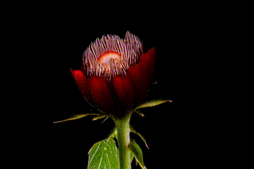
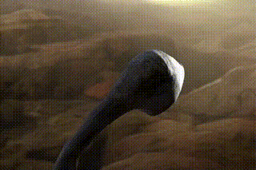
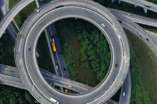
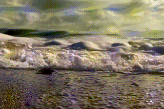

# MatchDiffusion: Training-free genration of Match-Cuts [](https://arxiv.org/abs/2411.18677) [](https://matchdiffusion.github.io)


This repo contains the code for [MatchDiffusion](https://matchdiffusion.github.io). A training-free method to automatically generate match cuts from a pair of textual prompts. Find more results in our website (better supported by Chrome) [MatchDiffusion](https://matchdiffusion.github.io) and understand more about or method in our paper [Paper Link](https://arxiv.org/abs/2411.18677).

### Table of Contents
- [What are MatchCuts?](#matchcuts)
- [Installation](#installation)
- [Usage for Match Cuts](#generate-matchcuts)
- [Usage for matching images (Stable Diffusion)](#generate-matching-images)
- [How to choose prompts?](#how-to-find-matching-prompts)
- [Citation](#citation)


<a name="matchcuts"></a>

## Wath are Match-Cuts?

A Match-Cut is a film editing technique where two shots are smoothly connected by aligning their visual, structural, or conceptual elements. This seamless transition not only guides the viewer's attention but also reinforces symbolic or temporal relationships within the narrative. Below, you'll find some match-cuts generated by our method.

<div align="center">

        
</div>


<a name="matchcuts"></a>

## Installation:
```
conda env create -f env.yml
conda activate matchdiff
```
Make sure you have a [Hugging Face account](https://huggingface.co/join) and login by running:
```
python huggingface_login.py
```
and entering your [Hugging Face Hub access token](https://huggingface.co/docs/hub/security-tokens#what-are-user-access-tokens) when prompted. It does not matter how you answer the Add token as git credential? (Y/n) question.

<a name="generate-matchcuts"></a>

# Generate MatchCuts 

Here we show a few examples of prompts that generate some cool matchcuts:

**Fossil ⇆ Spaceship (Kubrik inspired)**
```
python generate_matchcut.py --name fossil_spaceship --prompts "a video of a prehistoric long-shape bone being thrown into the air, spinning gracefully against the backdrop of an ancient landscape." "a video of a sleek elongated spacecraft gliding through the vastness of space, its metallic surface reflecting the stars as it moves effortlessly through the cosmos" --num_joint_steps 10 --seed 74 --num_samples 1
```

**Highway ⇆ IceStaking (inspired in [this blog](https://www.adobe.com/creativecloud/video/discover/match-cut.html))**
```
python generate_matchcut.py --name highway_iceskating --prompts "an aerial view of a busy, circular highway interchange, where a single yellow vehicle moves smoothly in loops, weaving through the flow of traffic." "an aerial view of a person in a yellow raincoat ice skating in perfect circles on a frozen lake, the ice glistening in the winter sunlight." --num_joint_steps 7 --seed 43 --num_samples 1
```

**Butterfly ⇆ Leaf**
```
python generate_matchcut.py --name butterfly_leaf --prompts "a video of a colorful autumn leaf falling from a tree, spiraling gently down to the ground" "a video of a butterfly fluttering gracefully from flower to flower, its wings a vivid display of color."
--num_joint_steps 10 --seed 42 --num_samples 1
```

**Waves ⇆ Ants**
```
python generate_matchcut.py --name waves_ants --prompts "a video of waves lapping gently at the shore, foam fizzing as the water recedes" "a video of a line of ants marching in unison along a forest floor, each ant moving with precise coordination" --num_joint_steps 15 --seed 44 --num_samples 1
```

**Flower blooming ⇆ Fireworks**
```
python generate_matchcut.py --name flower_fireworks --prompts "a video of a flower blooming in time-lapse, its petals unfurling to reveal intricate patterns." "a video of fireworks bursting in the night sky, the colors reflecting in a calm lake below." --num_joint_steps 7 --seed 1009 --num_samples 1
```

**Fire ⇆ City**
```
python generate_matchcut.py --name ember_city --prompts "a video of an ember glowing warmly in a campfire, flickering and pulsing with life as the surrounding wood crackles." "a video of a bustling city skyline lighting up at dusk, the golden and blue hues of twilight slowly giving way to the twinkling lights of skyscrapers." --num_joint_steps 12 --seed 53 --num_samples 1
```


**Leaves ⇆ Confetti**
```
python generate_matchcut.py --name leaves_confetti --prompts "a video of leaves rustling as a breeze sweeps through an autumn forest, scattering reds and yellows" "a video of colorful confetti raining down during a celebration, swirling and fluttering in the air" --num_joint_steps 15 --seed 47 --num_samples 1
```
<a name="how-to-find-matching-prompts"></a>

## How to Find Matching Prompts?

Finding the perfect prompt is an adventure—like capturing that iconic match-cut moment in film. Here are some easy tips to get you started:

- **Draw from existing match-cuts**  
  Look at famous examples such as Kubrick’s match-cuts or check out inspiring work like [Adobe’s blog post](https://www.adobe.com/creativecloud/video/discover/match-cut.html). Let these examples spark your creativity!

- **Visualize your idea**  
  If you can clearly picture the match-cut in your head, the model is more likely to bring that vision to life. Your imagination is the blueprint for success!

- **Match clear elements**  
  Pairing abstract ideas (like “sky” with “water”) can be tricky. Instead, try matching tangible movements, objects, or specific elements. This approach often yields better results.

- **Experiment and share**  
  Prompting is an art form. If you create something amazing, please **submit it (along with the command to reproduce it) to alejandro.pardo@kaust.edu.sa!**  

Enjoy exploring and have fun creating your match-cuts!

<a name="generate-matching-images"></a>

## Generate Matching Images (Stable Diffusion)

### Create Envinronment Stable Diffusion
```
conda env create -f envinronment_sd.yml
conda activate stable_diffusion
```

### Prompt examples for generating matching images


The results of these generated images are best experienced on our [website](https://matchdiffusion.github.io) (scroll to the bottom). To visualiza locally, we recommend toggling between the images. This back-and-forth comparison makes it easier to see if they truly match.

**Forest and Wine**
```
python generate_matching_images.py --name forest_wine --prompts "a picture of a colorful autumn forest." "a picture of a glass of red wine." --num_joint_steps 15 --seed 43 --num_samples 1 --save_dir generated_images
```

**Waterfall and Book Shelf**
```
python generate_matching_images.py --name forest_wine --prompts "a picture of a towering waterfall." "a picture of a cluttered bookshelf." --num_joint_steps 15 --seed 43 --num_samples 1 --save_dir generated_images
```

**Snowy Mountain and Graffiti Mural**
```
python generate_matching_images.py --name forest_wine --prompts "a picture of a snowy mountain peak." "a picture of a vibrant graffiti mural." --num_joint_steps 15 --seed 43 --num_samples 1 --save_dir generated_images
```

<a name="citation"></a>

## Citation
If you find your work useful, please cite us:
```bibtex
@article{pardo2024matchdiffusion,
  title={MatchDiffusion: Training-free Generation of Match-cuts},
  author={Pardo, Alejandro and Pizzati, Fabio and Zhang, Tong and Pondaven, Alexander and Torr, Philip and Perez, Juan Camilo and Ghanem, Bernard},
  journal={arXiv preprint arXiv:2411.18677},
  year={2024}
}
```

## Acknowledgements

This repo is highly inspired on the [Visual Anagrams](https://dangeng.github.io/visual_anagrams/) and [Factorized Diffusion](https://dangeng.github.io/factorized_diffusion/) papers' [repository](https://github.com/dangeng/visual_anagrams/blob/main/readme_factorized_diffusion.md).
